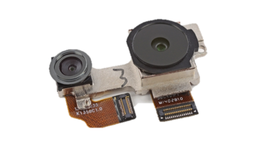
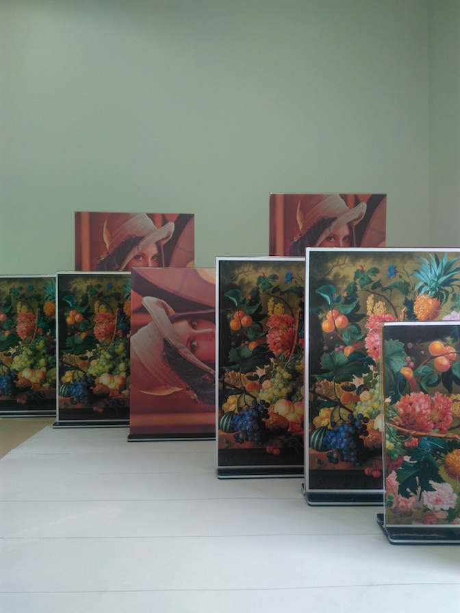
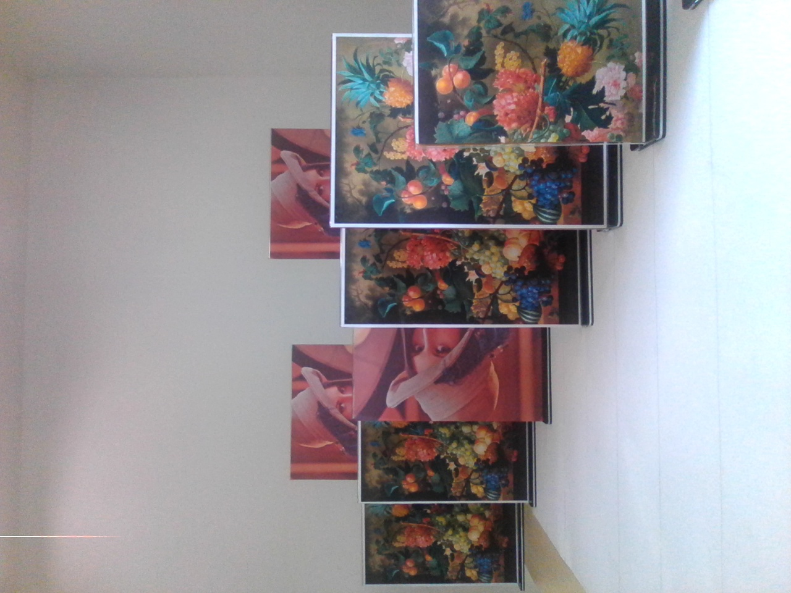
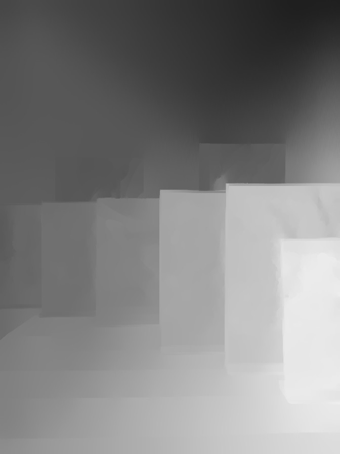
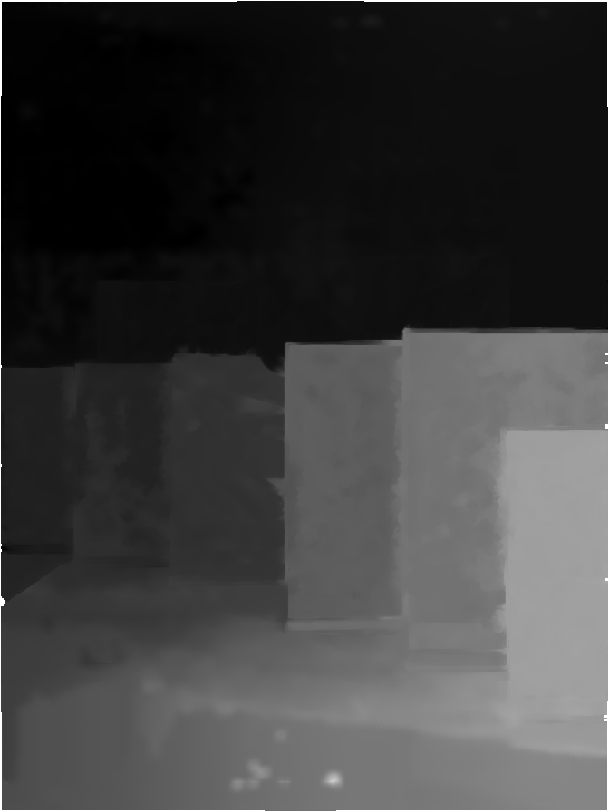

Stereo Vision Algorithm Demo
========================================================
author: Hawk Wang (yourwanghao@gmail.com)
date: 2015-10-24
transition: linear
font-family: 'Helvetica'
autosize: true
type: sub-section

Introduction
========================================================

<small>This demo shows the stereo correspondance algorithm comparison between my algorithm and a competitors'. 

The algorithms are running on a dual camera phone that has one 13M pixels camera, and one 2M pixels camera. <small>You can get more information on my shiny app at https://yourwanghao.shinyapps.io/StereoVisionDemo </small> 

The baseline between the two cameras is 20mm, and below is the camera module:</small>

Main Image and Sub Image
========================================================

I use the two cameras to take photo at the same time so that I can use stereo vision algorithms to generate disparity maps.
<small>Note: Sub image is 90 degree to main image.</small>

<table>
<tr>
<td width=40%></td>
<td></td>
</tr>
</table>

Disparity Map Comparison
========================================================
<table frame=void rules=none border="0">
<tr>
<th> Mine</th>
<th> Competitor's </th>
<tr>
<tr>
<td></td>
<td></td>
</tr>
</table>

Performance Comparison
========================================================

 
***
<small>As you can see from left figure, we test the disparity generation for ``10`` times. And
the result shows that mean time for competitor lib is ``5.359`` seconds, while for My lib it is ``2.097`` seconds. Apparently, my lib is ``much faster`` than the competitor's lib.

Note: The cell phone is based on QCOM MSM8939 platform, disparity map is 896 x 672 pixels</small>
